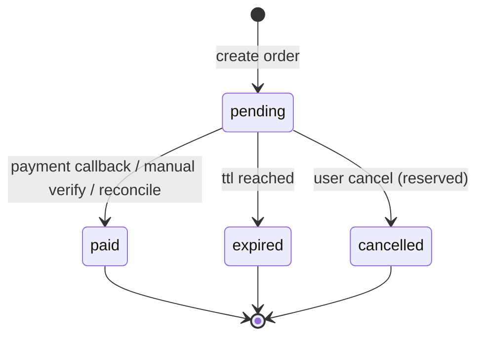

# 订单与会员状态机（P0）

## 1) 订单状态流转

约束：
- `pending -> paid|expired|cancelled` 是唯一允许流转。
- `paid|expired|cancelled` 为终态，不可逆。
- 幂等要求：重复回调或重复核销，`paid` 订单必须返回成功但不重复发货。

## 2) 会员开通与续期规则

会员到期时间计算函数：`calculateMembershipExpiresAt(currentExpiresAt, paidAt)`

规则：
- 新开通：当前无有效会员，`paidAt + 1 year`。
- 续期：当前会员未过期，`currentExpiresAt + 1 year`。
- 过期后再买：按新开通处理，`paidAt + 1 year`。

## 3) 并发与幂等设计

- 订单支付确认统一走 `fulfillPaidOrder()`。
- 更新订单使用条件更新：`where order_id = ? and status = 'pending'`，保证并发下仅一次成功。
- 更新失败后重查订单：若已是 `paid`，返回幂等成功。
- 会员开通失败时执行补偿：将本次刚置为 `paid` 的订单回滚为 `pending`（按 `order_id + transaction_id + paid_at` 精确匹配）。
- 创建订单接口复用同用户有效 `pending` 订单，防止重复点击产生多笔并发订单。

## 4) 前台反馈规则

- 轮询接口只以订单状态判断支付成功，不再以 `isMember=true` 误判成功。
- 前台展示：
  - `paid`：成功提示 + 3 秒倒计时 + 自动跳转 `/membership?payment=success`
  - `expired`：订单过期提示，允许一键重建订单
  - `pending`：每 5 秒轮询，倒计时同步显示

